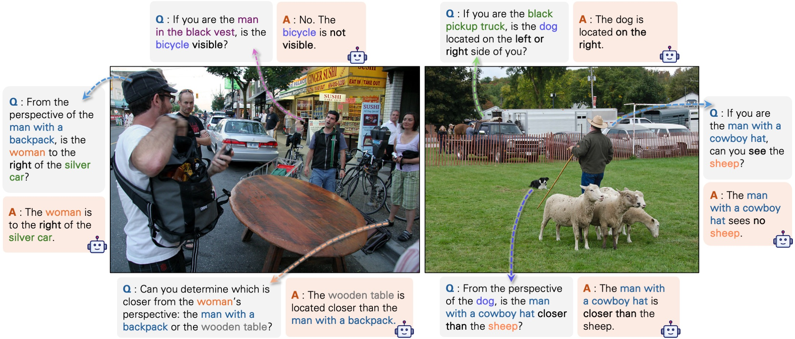

## Ego2Allo-VLM (APC): Allocentric ↔ Egocentric Spatial Reasoning with Visual Perspective Prompting

Ego2Allo-VLM implements the APC pipeline for perspective-aware visual question answering:
- Scene Abstraction: detect, segment, estimate depth and orientation for objects to build a lightweight 3D scene.
- Perspective Change: transform the scene to a target reference viewer’s perspective.
- Perspective Prompting: render an abstract, color-coded 3D scene and rewrite the question into egocentric form; query a VLM and map the abstract answer back to real objects.

This repo supports both local open-source VLMs (Qwen2.5-VL, Qwen3-VL) and API-based VLMs (Gemini 2.5).



### Highlights
- End-to-end APC pipeline in `apc/apc_pipeline.py`
- Visual prompt rendering with trimesh and PyTorch3D in `apc/renderer.py`
- Vision modules:
  - Detection/Segmentation: GroundingDINO + SAM
  - Depth: Depth Pro
  - Orientation: Orient-Anything
- Ready-made configs for Gemini 2.5 and Qwen2.5-VL
- Benchmark/eval utilities for SAT and 3DSRBench

---

## Environment

- Primary Conda env (shared cluster): `/ocean/projects/cis250208p/shared/.conda/envs/apc_vlm/`

    To use it via a local symlink and activate:

    ```bash
    ln -s /ocean/projects/cis250208p/shared/.conda/envs/apc_vlm/ ~/apc_vlm_env
    conda activate ~/apc_vlm_env
    ```

- Finetuning environment (shared cluster): `/ocean/projects/cis250208p/shared/.conda/envs/unsloth/`

    To use it via a local symlink and activate:

    ```bash
    ln -s /ocean/projects/cis250208p/shared/.conda/envs/unsloth/ ~/unsloth_env
    conda activate ~/unsloth_env
    ```

---

## Configuration

Configs live in `apc/configs/*.yaml`. Two ready-made examples:
- `gemini_2.5_flash.yaml`
- `qwenvl2_5_7b_instruct.yaml`

Update the following fields to match your environment:
- VLM
  - Gemini: set `vlm.api_key` and `vlm.model_name` (e.g., `gemini-2.5-flash`)
  - Qwen2.5-VL: set `vlm.pretrained_model` (e.g., `Qwen/Qwen2.5-VL-7B-Instruct`)
- Vision modules checkpoint paths
  - `detection.ckpt_path`, `segmentation.ckpt_path`, `depth.ckpt_path`, `orientation.ckpt_path`
  - These should point to the files downloaded by `setup/setup_vision_modules.sh`

Note: Some import paths in `apc/apc_pipeline.py` and `apc/vision_modules/*` assume the external repos are available on `sys.path`. If you place them elsewhere, update the `sys.path.append(...)` lines to point to your local clone directories.

---

## Evaluate on SAT

Script: `run_SAT.py`
- Edit the constants inside to point to your local SAT dataset folder:
  - `SAT_DATASET_FOLDER = "/path/to/SAT"`
  - The script expects `SAT_labeled.jsonl` under that folder (see `datasets/train/load_SAT.py` for building subsets)
- Choose VLM by editing `model_name` and `apc/configs/{model_name}.yaml`

Run (batched):

```bash
python run_SAT.py --start_index 0 --end_index 200
```

The script writes CSV predictions like `SAT_raw_predictions_{model_name}_*.csv`.
`run.sh` shows an example of chunking ranges and (optionally) managing Slurm jobs; adapt or ignore if not using Slurm.

The scripts also saves the conv history as train data if `save_as_train_data` is set to a path.

---

## Evaluate on 3DSRBench

Notebook: `run_3DSRBench.ipynb`

We include ready-made CSVs under `raw_predictions/` and summary metrics under `3DSRBench_metrics_summary*.csv` for reference.

---

## Supported VLMs
- Qwen2.5-VL (local): `apc/vlms/vlm_qwenvl2_5.py`
- Gemini 2.5 (API): `apc/vlms/vlm_gemini.py` (uses `openai` SDK with a Gemini-compatible endpoint)

To expose Qwen2.5-VL as a simple HTTP API, see `qwenvl_server.py` (FastAPI + Uvicorn).

---

## Outputs
- Visual prompts, overlays and conversation snapshots are saved under the `trace_save_dir` you provide (e.g., `outputs/benchmark/...`)
- For SAT/3DSRBench, you will get CSVs with per-example predictions and optional reasoning text

---

## Installation

Requirements:
- Python 3.10
- NVIDIA GPU + CUDA (tested with CUDA 12.x on Linux)
- Headless rendering support (pyglet, EGL) for server environments

1) Create environment

```bash
conda create -n ego2allo python=3.10 -y
conda activate ego2allo
```

2) Install PyTorch (match your CUDA version)

Visit pytorch.org for the exact command for your system. Example for CUDA 12.1:

```bash
pip install --index-url https://download.pytorch.org/whl/cu121 torch torchvision torchaudio
```

3) Install core Python deps

```bash
# minimal HF deps declared at repo root
pip install -r requirements.txt

# APC + vision module deps
pip install -r setup/requirements.txt

# Optional: PyTorch3D (if not already available)
# See https://github.com/facebookresearch/pytorch3d/blob/main/INSTALL.md
# Example (CUDA 12.1 wheels might vary by platform):
# pip install pytorch3d -f https://dl.fbaipublicfiles.com/pytorch3d/packaging/wheels/cu121/torch2.4/index.html
```

4) Install external vision modules and download checkpoints

Edit `setup/setup_vision_modules.sh` to set `VISION_MODULES_DIR` to a local path you control, then run:

```bash
bash setup/setup_vision_modules.sh
```

This will:
- Clone and install GroundingDINO, Depth Pro, Orient-Anything, Omni3D
- Download checkpoints for SAM, GroundingDINO, Depth Pro, Orient-Anything

5) Headless rendering (servers)

```bash
export PYGLET_HEADLESS=1
export DISPLAY=:1   # if using a virtual X display
```

If you get rendering errors, ensure EGL/Xvfb is available, and keep `pyglet==1.5.27` (already pinned).

---

## Troubleshooting
- Rendering/headless:
  - Set `PYGLET_HEADLESS=1` and ensure a working EGL/Xvfb setup
  - Keep `pyglet==1.5.27`
  - If trimesh fails to render, verify GPU drivers and that PyTorch3D is correctly installed
- Dependency pinning:
  - `numpy==1.23.4` is pinned for compatibility with several graphics libs
  - If Open3D conflicts arise, try installing a version compatible with your CUDA stack, or comment out Open3D usage if not needed
- Checkpoint paths:
  - If you see “file not found” for GroundingDINO/SAM/DepthPro/Orient-Anything, re-run `setup/setup_vision_modules.sh` and update paths in your YAML
- Gemini:
  - Ensure `vlm.api_key` is set in the YAML; network egress is required